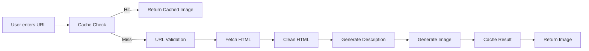

# GPT Browser 🌐✨

An AI-powered web browser visualization tool that generates realistic screenshot-like images of websites using AI models (OpenAI's GPT-Image-1 and Google's Gemini). Enter any URL and watch as AI creates a visual representation of what the website looks like, complete with progressive image streaming for real-time feedback.

## 🚀 [**DEMO**](https://browser.squirrelrecruit.com/)

  

## 🎯 What It Does

GPT Browser fetches the HTML content from any website URL and uses AI to:
1. Analyze the website's structure and content
2. Generate a detailed visual description
3. Create a realistic screenshot-like image showing how the website would appear when rendered
4. Cache results for instant future access

This is particularly useful for:
- Previewing websites without fully loading them
- Creating visual documentation of web pages
- Generating website thumbnails at scale
- Understanding website layouts through AI interpretation

## ✨ Key Features

- **🎨 AI-Generated Website Visualizations**: Creates realistic website screenshots using GPT-Image-1 or Gemini with provider switching
- **🖥️ Desktop Browser Simulation**: Displays results in a simulated desktop environment with browser chrome
- **⚡ Real-time Streaming**: Shows partial images as they're generated for progressive loading
- **💾 Smart Caching System**: Uses Vercel Blob storage to cache generated images (instant loads on repeat visits)
- **🛡️ URL Safety Validation**: AI-powered safety checking before processing URLs
- **📊 Comprehensive Analytics**: PostHog integration for usage tracking and LLM observability
- **📱 Responsive Design**: Works seamlessly on desktop and mobile devices
- **🔄 Dual Generation Mode**: Experimental endpoint for comparing different generation approaches

## 🏗️ Technical Architecture

### Technology Stack

- **Frontend**: Next.js 15.4.6 with React 19, TypeScript, Tailwind CSS 4
- **AI Models**: 
  - OpenAI GPT-5-nano (HTML cleaning, URL validation)
  - OpenAI GPT-5-mini (HTML description)
  - OpenAI GPT-Image-1 (image generation)
  - Google Gemini-2.5-flash-image-preview (alternative image generation)
- **Storage**: Vercel Blob Storage for image caching
- **Analytics**: PostHog for web analytics and LLM observability
- **Deployment**: Vercel with Edge Functions

### Processing Pipeline



### Project Structure

```
gpt-browser/
├── src/
│   └── app/
│       ├── api/
│       │   ├── generate-image/          # Main image generation endpoint
│       │   │   └── route.ts            # Handles streaming & caching
│       │   └── generate-image-dual/     # Experimental dual generation
│       │       └── route.ts
│       ├── components/
│       │   ├── DesktopScreen.tsx       # Desktop browser UI simulation
│       │   ├── PostHogPageView.tsx     # Analytics tracking component
│       │   └── PostHogProvider.tsx     # PostHog context provider
│       ├── hooks/
│       │   ├── useImageGeneration.ts   # Main streaming hook
│       │   └── useDualImageGeneration.ts # Dual generation hook
│       ├── lib/
│       │   └── openai.ts              # OpenAI client with PostHog integration
│       ├── utils/
│       │   ├── clean-html.ts          # HTML cleaning with GPT
│       │   ├── describe-html.ts       # HTML to image prompt conversion
│       │   ├── fetch-html.ts          # URL fetching with headers
│       │   ├── image-cache.ts         # Vercel Blob caching logic
│       │   ├── image-providers.ts     # Image generation providers
│       │   ├── validate-url.ts        # AI-powered URL validation
│       │   └── html-to-image.ts       # Main orchestration
│       ├── layout.tsx                  # Root layout with providers
│       └── page.tsx                    # Main application page
├── public/                             # Static assets
├── .env.example                        # Environment variables template
├── package.json                        # Dependencies and scripts
├── tailwind.config.ts                 # Tailwind configuration
├── next.config.mjs                    # Next.js configuration
└── tsconfig.json                      # TypeScript configuration
```

## 🚀 Getting Started

### Prerequisites

- Node.js 18+ and pnpm
- OpenAI API key with access to GPT-5-nano, GPT-5-mini, and GPT-Image-1
- Gemini API key (optional, for Gemini image generation)
- Vercel account (for Blob storage and deployment)
- PostHog account (optional, for analytics)

### Installation

1. **Clone the repository:**
```bash
git clone https://github.com/usesquirrel/gpt-browser.git
cd gpt-browser
```

2. **Install dependencies:**
```bash
pnpm install
```

3. **Set up environment variables:**
```bash
cp .env.example .env.local
```

4. **Configure your `.env.local`:**
```env
# Required
OPENAI_API_KEY=sk-proj-...                    # Your OpenAI API key

# Optional - Gemini Image Generation
GEMINI_API_KEY=...                            # Google Gemini API key

# Required for caching
BLOB_READ_WRITE_TOKEN=vercel_blob_...         # Vercel Blob storage token

# Optional - PostHog Analytics
NEXT_PUBLIC_POSTHOG_KEY=phc_...               # PostHog project API key
NEXT_PUBLIC_POSTHOG_HOST=https://us.i.posthog.com # PostHog host

# Optional - Vercel KV (if using KV for caching)
KV_URL=...
KV_REST_API_URL=...
KV_REST_API_TOKEN=...
KV_REST_API_READ_ONLY_TOKEN=...
```

5. **Run the development server:**
```bash
pnpm dev
```

6. **Open [http://localhost:3000](http://localhost:3000)**

## 📖 API Documentation

### POST `/api/generate-image`

Main endpoint for generating website visualizations with streaming support.

**Request Body:**
```json
{
  "url": "https://example.com"
}
```

**Response:** Server-Sent Events (SSE) stream
```
data: {"step":"checking_cache","message":"Checking image cache..."}
data: {"step":"validating","message":"Validating URL safety..."}
data: {"step":"fetching","message":"Fetching HTML from URL..."}
data: {"step":"describing","message":"Analyzing website structure..."}
data: {"step":"generating","message":"Generating image..."}
data: {"step":"partial_image","image":"base64...","partialIndex":0}
data: {"step":"completed","image":"base64...","mediaType":"image/png"}
data: [DONE]
```

### PUT `/api/generate-image`

Non-streaming version for simpler integrations.

**Request/Response:** Same as POST but returns JSON directly without streaming.

### POST `/api/generate-image-dual`

Experimental endpoint that generates images using two different approaches simultaneously.

## 🔧 Key Components

### `useImageGeneration` Hook

React hook for consuming the streaming API:

```typescript
const { state, isGenerating, generateImage, cancel, reset } = useImageGeneration();

// Generate image for a URL
await generateImage('https://example.com');

// Access current state
console.log(state.step); // 'fetching', 'generating', 'completed', etc.
console.log(state.image); // Base64 image data when completed
console.log(state.partialImages); // Array of partial images during generation
```

### Image Providers

The `ImageProviderFactory` supports multiple image generation models:

```typescript
// Currently supported:
- GPTImage1Provider: OpenAI's GPT-Image-1 model
  - Sizes: 1024x1024, 1024x1536, 1536x1024
  - Streaming: Supports partial images (1-3)
  - Max prompt: 32,000 characters
```

### Caching System

Automatic caching with Vercel Blob:

```typescript
// Cache keys are SHA-256 hashes of URLs
const cacheKey = generateCacheKey(url);

// Cache structure:
// - Image: stored as binary blob
// - Metadata: JSON with revisedPrompt, timestamp, etc.

// Cache hits return in <100ms
// Cache misses trigger generation (10-60s)
```

## 🔍 How It Works

### 1. URL Validation
- AI checks if the URL is safe and appropriate
- Blocks potentially harmful or inappropriate content
- Categories: safe, potentially_unsafe, unsafe

### 2. HTML Processing
- Fetches HTML with appropriate headers
- Cleans and simplifies HTML using GPT-5-nano
- Preserves essential visual structure

### 3. Description Generation
- GPT-5-mini analyzes cleaned HTML
- Creates detailed visual description
- Focuses on layout, colors, typography, spacing

### 4. Image Generation
- GPT-Image-1 creates visual from description
- Streams partial images during generation
- Final image is 1024x1536 (portrait) for better website representation

### 5. Caching
- Stores image and metadata in Vercel Blob
- Uses URL hash for consistent cache keys
- Automatic cache hits on repeat requests

## 📊 Observability & Monitoring

### PostHog Integration

The app tracks comprehensive analytics:

**Web Analytics:**
- Page views and navigation events
- Image generation requests and completions
- Cache hit/miss rates
- Error rates and types

**LLM Observability:**
- Token usage for each AI call
- Cost tracking with current pricing
- Latency measurements
- Success/failure rates
- Trace IDs for request correlation

**Tracked Events:**
- `html_cleaning`: HTML simplification process
- `html_description`: Description generation
- `image_generation`: Image creation
- `cache_operations`: Cache hits/misses

## 🚢 Deployment

### Vercel Deployment (Recommended)

1. **Fork this repository**

2. **Import to Vercel:**
   - Go to [vercel.com/new](https://vercel.com/new)
   - Import your forked repository
   - Configure environment variables

3. **Environment Variables in Vercel:**
   - Add all variables from `.env.local`
   - Enable Vercel Blob Storage in project settings
   - Set function timeout to 300s (Pro plan required)

4. **Function Configuration:**
```javascript
// Already configured in route.ts files:
export const runtime = 'nodejs';
export const maxDuration = 300; // 5 minutes for Pro plan
```

### Self-Hosting

Can be deployed to any Node.js hosting platform that supports:
- Next.js 15+
- Serverless/Edge Functions
- WebSocket/SSE for streaming
- File storage (for caching)

## 🐛 Troubleshooting

### Common Issues

**Partial images not showing:**
- OpenAI may only send 1 partial even when requesting 3
- This is normal behavior from the API
- The app handles this gracefully

**Timeout errors on Vercel:**
- Ensure you're on Vercel Pro plan (300s timeout)
- Check `maxDuration` is set in route files
- Verify `runtime = 'nodejs'` not 'edge'

**Cache not working:**
- Verify `BLOB_READ_WRITE_TOKEN` is set
- Check Vercel Blob Storage is enabled
- Ensure proper permissions on token

**High costs:**
- Image generation uses significant tokens
- Monitor usage in PostHog dashboard
- Consider implementing rate limiting

## 🤝 Contributing

We welcome contributions! Please follow these guidelines:

### Development Workflow

1. Fork the repository
2. Create a feature branch: `git checkout -b feature/amazing-feature`
3. Make your changes
4. Run linting: `pnpm lint`
5. Build to verify: `pnpm build`
6. Commit with descriptive message
7. Push to your fork
8. Open a Pull Request

### Code Style

- TypeScript for all new code
- Functional components with hooks
- Tailwind CSS for styling
- Comprehensive error handling
- Comments for complex logic

### Adding New Features

When adding features, consider:
- Backward compatibility
- Performance impact
- Cost implications (AI tokens)
- User experience (loading states, errors)
- Documentation updates

## 📄 License

This project is licensed under the MIT License - see the [LICENSE](LICENSE) file for details.

## 🙏 Acknowledgments

- OpenAI for GPT-5-nano, GPT-5-mini, and GPT-Image-1 models
- Vercel for hosting and blob storage
- PostHog for analytics and observability
- Next.js team for the amazing framework

## 📞 Support

- **Issues:** [GitHub Issues](https://github.com/usesquirrel/gpt-browser/issues)
- **Discussions:** [GitHub Discussions](https://github.com/usesquirrel/gpt-browser/discussions)

## 🚧 Known Limitations

- **Partial Images:** OpenAI's API may send fewer partial images than requested
- **Generation Time:** Complex websites take 30-60 seconds to generate
- **Accuracy:** AI interpretation may not perfectly match actual rendering
- **Dynamic Content:** JavaScript-rendered content won't be captured
- **Rate Limits:** Subject to OpenAI API rate limits

## 🗺️ Roadmap

- [ ] Support for more image generation models
- [ ] Batch URL processing
- [ ] Webhook support for async generation
- [ ] Browser extension
- [ ] API for third-party integrations
- [ ] Self-hosted model support
- [ ] WebSocket real-time updates

---

Made with ❤️ by the GPT Browser team